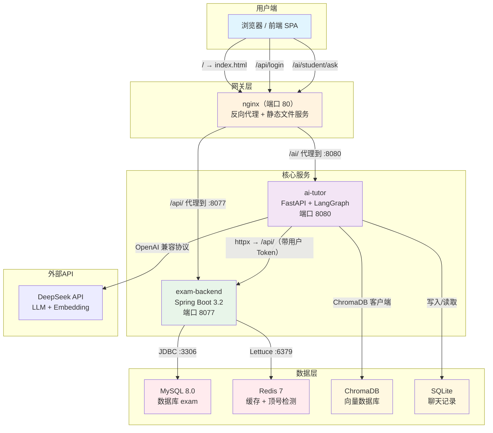

# 第 1 课：项目架构全景

> ⏱ 预计时间：90 分钟（概念 20 min + 读代码 40 min + 练习 30 min）
>
> 📁 本课涉及文件：
> `nginx.conf` · `docker-compose.yml` · `docker-compose.dev.yml` · `.env.docker` · 三个 Dockerfile

---

## 1. 本课目标

学完这节课，你应该能：

- ✅ 在白板上画出整个系统的服务拓扑图（三个服务 + 中间件 + 前端）
- ✅ 说清**为什么拆成三个服务**而不是一个单体
- ✅ 看懂 nginx 配置中每个 `location` 的含义
- ✅ 说清一条 HTTP 请求从前端到后端再到数据库的完整路径
- ✅ 理解 `docker-compose.yml` 中各容器的依赖关系
- ✅ 理解 JWT Token 在三个服务之间的流动方式
- ✅ 在本地启动开发环境（MySQL + Redis），验证项目能跑起来

---

## 2. 为什么第一节课要学架构？

很多新手拿到项目就直接打开 `BaseUserController.java` 开始读，很快就会被各种注解、依赖注入、拦截器搞晕——因为**不知道这些代码在系统里的位置**。

理解架构就像拿到一张**地图**：
- 你知道**现在在哪里**（前端 / 后端 / AI 服务）
- 你知道**请求去哪**（nginx 路由规则）
- 你知道**哪些部分相互依赖**（backend 依赖 MySQL + Redis）

有了地图，再读代码就不会迷路。

---

## 3. 宏观架构图

这是本项目的完整架构。花 5 分钟仔细看这张图，然后我们拆开讲。



**请求示例**：用户打开浏览器访问 `http://localhost:8088`，登录后参加一场考试——这个请求会经过以下路径：

```
浏览器 → nginx(:80) → /api/ → exam-backend(:8077) → MySQL(:3306)
                                            ↓
                                         Redis(:6379) ← 读取试卷缓存
       ← ← ← ← ← ← nginx ← ← ← Result ←
                                            → 返回 JSON 到浏览器渲染
```

---

## 4. 核心知识点

### 4.1 为什么拆成三个服务？（单体 vs 微服务）

这是你面试时几乎一定会被问到的问题。对照本项目的实际情况来理解：

| 维度 | 单体架构（如果是单体） | 当前架构（三服务） |
|------|----------------------|-------------------|
| 开发语言 | 必须统一（全部 Java 或全部 Python） | **Java 做后端、Python 做 AI**，各取所长 |
| 部署 | 一个 jar/war 包 | 三个独立容器，**可单独扩缩容** |
| 团队协作 | 所有人在一个代码库 | **前后端可同时开发**，AI 服务可独立迭代 |
| 风险隔离 | AI 模块内存泄漏 → 整个系统崩溃 | AI 挂了 → 考试系统**仍然可用** |
| 技术栈 | 单一 | 每个服务选最适合的技术 |

**本项目选择分拆的核心原因**：

1. **AI 开发生态在 Python**：LangGraph、ChromaDB、DeepSeek SDK 全是 Python 生态的。用 Java 做 AI 不是不行，但社区支持和第三方库远不如 Python。把 AI 抽成独立服务，两边都能用自己最好的工具。

2. **两类服务负载特征不同**：考试 API 是低延迟（<500ms）、高并发（几百人同时考试）；AI API 是高延迟（5～30s）、低并发（一次 AI 调用消耗大量 token）。混在一起，AI 请求会阻塞 Tomcat 线程池，拖慢正常考试。

3. **独立演进**：AI Agent 的 Prompt、LangGraph 版本迭代频繁，可能每天改；考试系统的核心业务逻辑很少变。分开后 AI 可以独立上线而不影响考试。

> 💡 **面试加分**：当面试官问"你这个项目为什么拆微服务？"不要背概念，而是用上面**第三条**结合你的实际开发体验来说——"我们 AI 模块的 Prompt 迭代很快，如果和考试系统耦合在一起，每次改 Prompt 都要重新部署整个系统……"

### 4.2 nginx 路由规则

nginx 在这里扮演**两个角色**：

1. **静态文件服务器**：前端编译后的 `.html` / `.js` / `.css` 文件放在 `/usr/share/nginx/html`，nginx 直接返回
2. **反向代理**：把 `/api/` 开头的请求转发给后端，把 `/ai/` 开头的请求转发给 AI 服务

关键规则只有三条（对应 nginx.conf 中的三个 `location`）：

| 请求路径 | 处理方式 | 目标 |
|---------|---------|------|
| `GET /index.html` | 直接返回文件 | 本地文件系统 |
| `GET /api/user/login` | **代理**到 `http://exam_backend/user/login` | Spring Boot :8077 |
| `GET /ai/student/ask` | **代理**到 `http://ai_tutor/student/ask` | FastAPI :8080 |
| `GET /exam/123` | SPA **回退**到 `/index.html`（由前端路由处理） | 本地文件系统 |

**SPA 回退**（`try_files $uri $uri/ /index.html`）是什么意思？

用户访问 `http://localhost/exam/123` 时，nginx 先尝试找 `/exam/123` 这个文件→没有，再尝试 `/exam/123/` 目录→也没有，最后返回 `index.html`。Vue Router 拿到 `/exam/123` 这个路径后，在自己的路由表里找到对应组件并渲染。

这就是 SPA（单页应用）的标准做法——**只有一个 HTML 入口，路由在浏览器端控制**。

### 4.3 Docker Compose 容器依赖链

查看 `docker-compose.yml`，5 个容器之间有明确的启停顺序：

```
mysql ────→ backend ──→ nginx
  │                    ↑
  └──→ redis ────→ backend
                       ↓
              ai-tutor → nginx (也依赖 backend)
```

对应配置中的 `depends_on` + `condition: service_healthy`：

```yaml
# backend 依赖 MySQL 和 Redis 健康后才启动
backend:
  depends_on:
    mysql:
      condition: service_healthy   # 健康检查通过才启动
    redis:
      condition: service_healthy

# nginx 依赖 backend 和 ai-tutor 启动
nginx:
  depends_on:
    - backend
    - ai-tutor
```

`healthcheck` 的检测方式：

| 容器 | 检测命令 | 频率 |
|------|---------|------|
| MySQL | `mysqladmin ping` | 每 5s 检测，最多重试 10 次 |
| Redis | `redis-cli ping` | 每 5s 检测，最多重试 5 次 |

**为什么 nginx 不设 healthcheck？** 因为 nginx 是反向代理——它不需要依赖其他服务才能启动（只是启动后转发请求会 502，等 backend 和 ai-tutor 起来后就正常了）。

### 4.4 JWT 跨服务认证流

这是本项目最巧妙的设计之一。AI 服务本身没有独立的用户系统，而是**共享 Spring Boot 的 JWT 密钥**。

```
浏览器登录成功
    │
    ├─ 后端返回 JWT Token（用 JWT_SECRET 签名）
    │
    ├─ 浏览器存到 sessionStorage
    │
    ├─ 浏览器请求后端 /api/  → 携带 Authorization: Bearer <token>
    │   └─ JwtInterceptor 用 JWT_SECRET 解密
    │      └─ 通过 → 放行；不通过 → 401
    │
    └─ 浏览器请求 AI /ai/  → 携带同样的 Authorization: Bearer <token>
        └─ ai-tutor 的 jwt_util.py 用**同一个** JWT_SECRET 解密
           └─ 通过 → 继续；不通过 → 401
              └─ AI 服务需要访问后端数据时 → 把用户的 Token 带到 /api/ 请求
                 └─ JwtInterceptor 又可以用同个密钥验证！
```

**关键文件**：
- `JwtUtil.java`（Java 端生成 + 验证）
- `jwt_util.py`（Python 端验证）
- 密钥来源：环境变量 `JWT_SECRET`（在 `.env.docker` 中配置）

**为什么 AI 服务不自己做用户系统？**

1. 避免重复开发——用户注册、登录、角色管理已经在后端实现了
2. 统一安全策略——密码策略、账号锁定、日志审计都在一处
3. **权限一致**——AI 服务通过 `ExamBridge` 访问后端时，使用调用者本人的 Token，后端看到的角色就是该用户的角色，不会越权

---

## 5. 代码阅读（guided walkthrough）

现在我们来逐行看关键配置文件。**打开文件跟着读**，不要只看这里的摘要。

### 5.1 阅读 nginx.conf

```
A:\Online-exam-system\nginx.conf
```

**逐行解读**：

| 行号 | 代码 | 说明 |
|------|------|------|
| 6-8 | `upstream exam_backend` | 定义后端服务器组，指向 `127.0.0.1:8077` |
| 10-12 | `upstream ai_tutor` | 定义 AI 服务组，指向 `127.0.0.1:8080` |
| 15 | `listen 80` | nginx 监听 80 端口 |
| 19 | `root /usr/share/nginx/html` | 静态文件根目录 |
| 20 | `index index.html` | 默认首页 |
| 23-30 | `location /api/` | **代理规则 1**：以 `/api/` 开头的请求 → Spring Boot |
| 33-42 | `location /ai/` | **代理规则 2**：以 `/ai/` 开头的请求 → FastAPI（注意 `proxy_read_timeout 120s` 更长） |
| 45-47 | `location /` | **代理规则 3**：其他所有请求 → SPA 回退 |

> **为什么 AI 的超时是 120s？** LLM 调用可能很慢（尤其是 DeepSeek 的推理模型），普通请求 60s 超时，AI 请求给 120s 防止频繁超时。

### 5.2 阅读 docker-compose.yml

```
A:\Online-exam-system\docker-compose.yml
```

**分三层理解**：

**第一层 — 基础设施**（mysql + redis）：
```yaml
mysql:
  image: mysql:8.0
  environment:
    MYSQL_ROOT_PASSWORD: ${MYSQL_ROOT_PASSWORD:-root123}
    MYSQL_DATABASE: exam
  volumes:
    - mysql_data:/var/lib/mysql
  healthcheck:
    test: ["CMD", "mysqladmin", "ping", ...]
```

> 注意 `${MYSQL_ROOT_PASSWORD:-root123}` 语法：`:-` 表示如果没有设置环境变量，默认值为 `root123`。

**第二层 — 业务服务**（backend + ai-tutor）：
```yaml
backend:
  build:
    context: ./exam-backend    # Dockerfile 在这个目录
    dockerfile: Dockerfile
  environment:
    SPRING_DATASOURCE_URL: jdbc:mysql://mysql:3306/exam?...
    # ↑ 注意：这里用了服务名 mysql，而不是 localhost
    # Docker Compose 内部 DNS 会自动解析
  depends_on:
    mysql:
      condition: service_healthy
```

> **开发和生产的关键差异**：开发时 Spring Boot 连 `localhost:3306`（原生启动），生产中连 `mysql:3306`（容器内 DNS）。配置在 `application.yml` 和 `docker-compose.yml` 中分别控制。

**第三层 — 网关**（nginx）：
```yaml
nginx:
  build:
    context: ./exam-frontend   # 注意！nginx 的 Dockerfile 在前端项目里
    dockerfile: Dockerfile
  ports:
    - "8088:80"                # 宿主机 8088 → 容器 80
```

> **为什么 nginx 的 Dockerfile 在前端项目里？** 因为前端编译后的 `dist/` 需要复制到 nginx 镜像中。前端的 Dockerfile 是「多阶段构建」：第一阶段用 node 编译，第二阶段把编译产物复制到 nginx 镜像。

### 5.3 阅读 .env.docker

```
A:\Online-exam-system\.env.docker.example
```

这是一个模板文件。部署时复制为 `.env.docker`，填入真实密钥。

**各组变量的作用**：

| 组 | 变量 | 影响范围 |
|----|------|---------|
| MySQL | `MYSQL_ROOT_PASSWORD`, `DB_USERNAME`, `DB_PASSWORD` | backend 连接数据库 |
| JWT | `JWT_SECRET` | **backend + ai-tutor**（必须一致！） |
| 邮件 | `MAIL_AUTH_CODE` | backend 的 QQ SMTP |
| LLM | `LLM_API_KEY`, `EMBEDDING_API_KEY` | ai-tutor 调用大模型 |

### 5.4 阅读三个 Dockerfile

**后端 Dockerfile**（`exam-backend/Dockerfile`）：

```
阶段 1 (build): maven:3.9-eclipse-temurin-21-alpine
  → 先 pom.xml → 拉依赖（利用 Docker 缓存）
  → 再复制源码 → mvn package
  
阶段 2 (runtime): eclipse-temurin:21-jre-alpine
  → 只复制 jar 包（镜像小了很多！）
  → java -jar app.jar
```

**多阶段构建**的目的：最终镜像只包含 JRE 和 jar，不包含 Maven 和源码，镜像体积从 500MB+ 降到 200MB 左右。

**前端 Dockerfile**（`exam-frontend/Dockerfile`）：

```
阶段 1 (build): node:22-alpine
  → npm ci（安装依赖）
  → npm run build（vite 构建）
  
阶段 2 (serve): nginx:alpine
  → 复制 dist/ 到 /usr/share/nginx/html
  → 复制 nginx.conf 到配置目录
  → nginx -g "daemon off;"
```

**AI Dockerfile**（`ai-tutor/Dockerfile`）：

```
FROM python:3.12-slim
→ pip install -r requirements.txt
→ uvicorn main:app --host 0.0.0.0 --port 8080
```

> 注意安装了 `build-essential`（编译依赖），因为 ChromaDB 的底层依赖需要本地编译。

---

## 6. 动手练习

### 练习 1：画架构图（30 分钟）

**要求**：用纸笔（或 draw.io / Excalidraw）画出完整的系统架构图，必须包含：

1. 浏览器 + nginx + 三个服务 + MySQL + Redis + ChromaDB + 外部 API
2. 每个组件的端口号
3. 三条 API 请求的完整路径（登录、参加考试、向 AI 提问）
4. JWT Token 的流动方向

**完成后的自测问题**（每道题都要能回答）：

```
1. 用户在浏览器输入 http://localhost:8088 发生了什么？
   （提示：nginx 返回 index.html → 加载 Vue SPA → JavaScript 执行 → 路由判断）

2. 用户点击登录后，请求怎么走？
   （提示：POST /api/user/login → nginx → exam-backend:8077 → MySQL 查用户 → 返回 JWT）

3. 用户在考试中切换标签页被警告，这个逻辑在哪一层？
   （提示：在前端 Exam.vue 的 visibilitychange 事件，不是后端）

4. AI 回答学生问题时，答案是从哪里检索的？
   （提示：ChromaDB 向量检索 → 注入 LLM 上下文 → LLM 生成回复）

5. 如果 AI 服务挂了，系统还能考试吗？
   （提示：能，nginx 返回 502，前端 FloatingTutor 显示"AI 暂时不可用"）
```

---

### 练习 2：本地启动开发环境（建议课后完成）

跟着 CLAUDE.md 的指引，启动本地开发环境。目标是在终端看到以下输出：

```bash
# 终端 1：MySQL + Redis
cd A:\Online-exam-system
docker compose -f docker-compose.dev.yml up -d
# 输出: ✔ Container exam-mysql-dev  Started
#       ✔ Container exam-redis-dev  Started

# 验证 MySQL 连接
docker exec exam-mysql-dev mysql -uroot -proot123 exam -e "SHOW TABLES;"
# 输出: 8 张表（users, subjects, questions, exam_papers...）

# 验证 Redis 连接
docker exec exam-redis-dev redis-cli ping
# 输出: PONG
```

---

### 练习 3：验证你的理解（5 分钟填空）

```
1. 本项目中 nginx 监听端口 _80_，Docker 部署时映射到宿主机的 _8088：80端口

2. 考试系统的所有 API 都以 _/api___ 开头，AI 服务的 API 都以 _/ai___ 开头。

3. backend 和 ai-tutor 共享同一个 _jwt_secret___ 来验证用户身份。

4. 开发时启动后端需要先启动 ____ 和 ____（使用 docker-compose.dev.yml）。

5. nginx.conf 中 location / 的 try_files 作用是处理 ____ 的路由。
```

> 答案见文末。

---

## 7. 本课总结

### 核心记忆点

1. **三个服务**：exam-backend（Java 业务）、exam-frontend（Vue 前端）、ai-tutor（Python AI）
2. **一个网关**：nginx 根据路径前缀分发请求（`/api/` → 后端，`/ai/` → AI，其余 → SPA）
3. **一套认证**：JWT Token 在所有服务间共享（同一个 `JWT_SECRET`）
4. **两种运行模式**：
   - 开发：`docker-compose.dev.yml` 只启动 MySQL + Redis，各服务本地原生启动
   - 生产：`docker-compose.yml` 启动全部 5 个容器

### 下节课预告

第 2 课我们将走进 Spring Boot 后端，学习项目的配置文件体系（`application.yml`、`pom.xml`、配置类）。你会理解：

- 为什么 Spring Boot 的自动配置能省掉大量 XML？
- application.yml 中每一段配置对应什么功能？
- Maven 的依赖管理和插件体系

---

**练习 3 答案**：`1. 80, 8088` `2. /api/, /ai/` `3. JWT_SECRET` `4. MySQL, Redis` `5. SPA 前端路由`

---

> 📌 本课属于「在线考试系统全栈课程」，完整课表见 `CURRICULUM.md`，学习路线见 `LEARNING_ROADMAP.md`。
