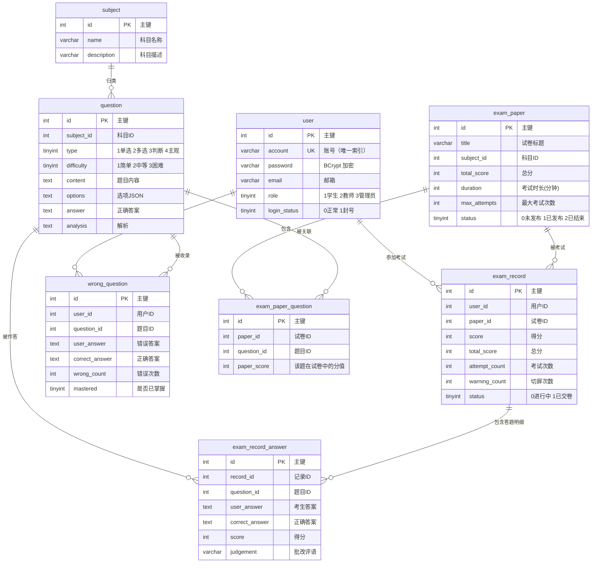

# 第 3 课：数据库设计与 ORM 层

> ⏱ 预计时间：90 分钟（概念 30 min + 读代码 40 min + 练习 20 min）
>
> 📁 本课涉及文件：
> `schema-admin.sql` · `data-408.sql` · `pojo/entity/`（8 个实体类）· `mapper/`（8 个接口）· `DatabaseMigrationRunner.java` · `ExamRecordServiceImpl.java` · `BaseUserServiceImpl.java`

---

## 1. 本课目标

学完这节课，你应该能：

- ✅ 画出 8 张核心表的 ER 关系图，理解每张表的职责
- ✅ 解释多对多关系为何要引入中间表（`exam_paper_question`）
- ✅ 说清错题集（`wrong_question`）表的设计意图：为什么不用 `exam_record_answer` 代替？
- ✅ 掌握 MyBatis-Plus 的核心注解：`@TableName`、`@TableId`、`@TableField`
- ✅ 理解 `BaseMapper<T>` 接口的"零 XML"魔法——为什么不用写一行 SQL 就能 CRUD？
- ✅ 熟练使用 `LambdaQueryWrapper` 构建类型安全的查询条件
- ✅ 掌握 `DatabaseMigrationRunner` 的增量 DDL 迁移模式
- ✅ 在项目中新增一个数据库字段——从 SQL 到 Entity 到 Service 的完整链路

---

## 2. 概念讲解

### 2.1 为什么这节课如此重要？

前两节课我们学了「架构地图」和「骨架配置」，这节课我们开始接触**项目的心脏**——数据库。

考试系统的本质是什么？**把题目存起来，让学生答题，把答案存起来，把分数算出来**。这一切都围绕数据库展开。如果你不搞清楚表结构和 ORM 层，后面读任何业务代码都会寸步难行：

```
读 Service 代码 → 看到 this.getOne(...) → 不知道查的哪张表 → 卡住
看 Controller → 看到 examRecordService.submitExam(...) → 不知道更新了哪些表 → 卡住
```

这节课就是给你的"数据库地图"——有了它，后面所有业务代码你都看得懂。

### 2.2 8 张核心表全景 ER 图

花 5 分钟仔细看这张图，然后我们逐表讲解。



**三层分组理解**：

```
第一层：基础数据（独立存在，不依赖其他表）
  subject（科目） — 科目树
  question（题目） — 题库（属于某个科目）
  user（用户） — 用户体系

第二层：业务组装（组合基础数据）
  exam_paper（试卷） — 考试容器
  exam_paper_question（试卷-题目关联） — 多对多中间表

第三层：运行时数据（考试过程中的动态记录）
  exam_record（考试记录） — 一次考试的整体状态
  exam_record_answer（答题明细） — 每道题的作答情况
  wrong_question（错题集） — 历史错误汇总
```

> 💡 面试中常问："你项目中怎么设计表结构？"不要背 SQL 语句，先画这张分组图——基础数据 → 业务组装 → 运行时数据，考官会觉得你思路清晰。

### 2.3 逐表深解——不止于字段名

#### 2.3.1 `user`（用户表）

```sql
CREATE TABLE IF NOT EXISTS user (
  id INT PRIMARY KEY AUTO_INCREMENT,
  account VARCHAR(50) NOT NULL,
  password VARCHAR(255) NOT NULL,
  role TINYINT NOT NULL COMMENT '1学生 2教师 3管理员',
  login_status TINYINT NOT NULL DEFAULT 0 COMMENT '0正常 1封号',
  UNIQUE INDEX uk_user_account (account)
);
```

**设计要点**：

1. **`password` 长度 255**：因为存的是 BCrypt 加密后的字符串（`$2b$10$...`），原始密码 6 位，加密后 60 位。255 给足余量。
2. **`account` 唯一索引**：登录时通过账号查用户，这是最高频的查询之一。`UNIQUE INDEX` 同时保证了唯一性和查询性能。
3. **`role` 用 TINYINT 而非 ENUM**：ENUM 变更需要 ALTER TABLE，且 JDBC 驱动兼容性不好。TINYINT + Java 枚举是最灵活的方案。
4. **`login_status` 不是 `is_locked`**：命名为 "login status" 而非 "is locked" 是为扩展性——以后可能有"0 正常 / 1 封号 / 2 临时冻结 / 3 未验证邮箱"。

```sql
-- 默认管理员（账号 admin，密码 123456，BCrypt 加密）
INSERT IGNORE INTO user (id, account, password, username, role, email, login_status, create_time)
VALUES (1, 'admin', '$2b$10$P2rqMDKks/zYfWA.i4f15.3NHkX2tdgECbcFdDNS6VWFK38fiOPVq', '管理员', 3, 'admin@example.com', 0, NOW());
```

> 💡 `INSERT IGNORE` + `id = 1`：保证管理员一定存在且 ID 固定。`IGNORE` 确保重复执行不会报错——这是**幂等设计**的体现。

#### 2.3.2 `subject`（科目表）

```sql
CREATE TABLE IF NOT EXISTS subject (
  id INT PRIMARY KEY AUTO_INCREMENT,
  name VARCHAR(50) NOT NULL,
  description VARCHAR(200),
  create_time DATETIME NOT NULL DEFAULT CURRENT_TIMESTAMP
);
```

**最简洁的表**，但在整个系统中扮演**组织角色**：题目按科目归类、试卷按科目筛选。相当于文件系统中的"文件夹"。

#### 2.3.3 `question`（题目表）

```sql
CREATE TABLE IF NOT EXISTS question (
  id INT PRIMARY KEY AUTO_INCREMENT,
  subject_id INT NOT NULL,
  subject_name VARCHAR(50) NOT NULL,
  type TINYINT NOT NULL COMMENT '1单选 2多选 3判断 4主观',
  difficulty TINYINT NOT NULL COMMENT '1简单 2中等 3困难',
  content TEXT NOT NULL,
  options TEXT,
  answer TEXT NOT NULL,
  analysis TEXT,
  score INT NOT NULL DEFAULT 1,
  create_time DATETIME NOT NULL DEFAULT CURRENT_TIMESTAMP
);
```

**核心设计决策**：

1. **为什么存 `subject_name` 冗余？**

   按照数据库范式，有了 `subject_id` 就不该存 `subject_name`（违反 3NF）。但本项目故意保留这个冗余——因为：
   - 题目列表是最高频查询之一，如果每次都 JOIN `subject` 表，性能差
   - 科目名几乎不会变，冗余风险低
   - 这是**读写比极高**场景下的典型反范式优化

   > 💡 面试加分：你主动提"这里有一点反范式设计，但做了权衡——科目名基本不变，查询频率远超修改频率，冗余换性能是划算的。"

2. **`options` 存什么格式？**

   ```json
   ["A. 快速排序", "B. 冒泡排序", "C. 归并排序", "D. 插入排序"]
   ```

   存 JSON 字符串而不是分表 —— 因为选项数量 2～6 个，属于"少量可变结构"，JSON 列比单独建表更简单。

3. **四种题型共用一张表**：`type` 字段区分。单选存 "A"，多选存 "A,B,C"，判断存 "1"（对）或 "0"（错），主观存长文本。一套字段覆盖全部题型，避免拆表带来的 JOIN 复杂度。

#### 2.3.4 `exam_paper`（试卷表）

```sql
CREATE TABLE IF NOT EXISTS exam_paper (
  id INT PRIMARY KEY AUTO_INCREMENT,
  title VARCHAR(100) NOT NULL,
  subject_id INT NOT NULL,
  subject_name VARCHAR(50) NOT NULL,
  total_score INT NOT NULL,
  duration INT NOT NULL,
  max_attempts INT NOT NULL DEFAULT 1 COMMENT '考试次数限制',
  status TINYINT NOT NULL DEFAULT 0 COMMENT '0未发布 1已发布 2已结束',
  start_time DATETIME,
  end_time DATETIME,
  create_time DATETIME NOT NULL DEFAULT CURRENT_TIMESTAMP
);
```

**试卷状态机**：

```
[未发布] ──(发布)──→ [已发布] ──(到期)──→ [已结束]
  status=0            status=1            status=2
```

- `status=0`：学生不可见，教师可编辑
- `status=1`：学生可见且可参加
- `status=2`：已过期，学生不可参加

**`max_attempts` 字段**：控制重考次数（默认 1 次），通过 `DatabaseMigrationRunner` 在 2026-07-07 增量添加的。这是后面第 7 课"考试全生命周期"中的重考覆盖策略的关键字段。

#### 2.3.5 `exam_paper_question`（试卷-题目关联表）

```sql
CREATE TABLE IF NOT EXISTS exam_paper_question (
  id INT PRIMARY KEY AUTO_INCREMENT,
  paper_id INT NOT NULL,
  question_id INT NOT NULL,
  paper_score INT NOT NULL,
  create_time DATETIME NOT NULL DEFAULT CURRENT_TIMESTAMP
);
```

**这是整个数据库中最关键的一张表**——它拆解了试卷和题目的**多对多关系**。

**为什么需要中间表？**

```
一张试卷可以有多道题（1:N）
一道题也可以出现在多张试卷中（1:N）
→ 合起来就是 M:N（多对多）
```

如果不引入中间表，你在 `exam_paper` 表中怎么存题目？只能：
- ❌ 多列存储：`question_1, question_2, question_3...`（列数固定，不可扩展）
- ❌ JSON 存储：`[1, 2, 3]`（无法建外键，查询困难）
- ✅ **中间表**：每个关联一行

**`paper_score` 为什么放在关联表？**

同一道题在不同试卷中可能分值不同——期中考试里数据结构占 10 分，期末考试里只占 5 分。所以"题目在该试卷中的分值"是关联本身的属性，必须放在中间表。

> 💡 面试高频：被问到"多对多关系怎么设计"时，直接举 `exam_paper_question` 的例子，同时解释 `paper_score` 为什么在关联表。

#### 2.3.6 `exam_record`（考试记录表）

```sql
CREATE TABLE IF NOT EXISTS exam_record (
  id INT PRIMARY KEY AUTO_INCREMENT,
  user_id INT NOT NULL,
  username VARCHAR(50) NOT NULL,
  paper_id INT NOT NULL,
  paper_title VARCHAR(100) NOT NULL,
  score INT NOT NULL DEFAULT 0,
  total_score INT NOT NULL,
  pass_score INT NOT NULL DEFAULT 60,
  attempt_count INT NOT NULL DEFAULT 1 COMMENT '当前记录累计考试次数',
  warning_count INT NOT NULL DEFAULT 0 COMMENT '切屏/离开页面次数',
  status TINYINT NOT NULL DEFAULT 0 COMMENT '0进行中 1已交卷',
  start_time DATETIME,
  submit_time DATETIME,
  create_time DATETIME NOT NULL DEFAULT CURRENT_TIMESTAMP
);
```

**考试状态机**：

```
[进行中] ──(提交)──→ [已交卷]
 status=0            status=1
```

**冗余字段说明**：
- `username` / `paper_title`：同样是反范式设计，考试记录的查询远多于创建，冗余避免 JOIN
- `attempt_count`：记录这是第几次考试（用于重考次数控制）
- `warning_count`：切屏/离开页面的计数（前端捕获 `visibilitychange` 事件，每次 +1，后端只存最终值）
- `highest_score`：历史最高分（也在 `DatabaseMigrationRunner` 中增量添加）

#### 2.3.7 `exam_record_answer`（答题明细表）

```sql
CREATE TABLE IF NOT EXISTS exam_record_answer (
  id INT PRIMARY KEY AUTO_INCREMENT,
  record_id INT NOT NULL,
  question_id INT NOT NULL,
  type TINYINT NOT NULL,
  question_content TEXT NOT NULL,
  options TEXT,
  user_answer TEXT,
  correct_answer TEXT,
  full_score INT NOT NULL,
  score INT NOT NULL DEFAULT 0,
  judgement VARCHAR(20),
  create_time DATETIME NOT NULL DEFAULT CURRENT_TIMESTAMP
);
```

**与 `exam_record` 的一对多关系**：一条考试记录（`exam_record`）包含多条答题明细（`exam_record_answer`），通过 `record_id` 关联。

**为什么存 `question_content` 和 `options` 快照？**

学生在 A 时刻答题时，题目内容是什么就是什么。如果后来教师修改了题目，A 时刻的答题记录不应该跟着变。这叫做**时间点快照**——试卷一旦开始，题目内容就应该定格。

**`judgement` 字段**：主观题的批改评语（如"思路正确，计算过程有误"），选题题自动判分后为空。

#### 2.3.8 `wrong_question`（错题集表）

```sql
CREATE TABLE IF NOT EXISTS wrong_question (
  id INT PRIMARY KEY AUTO_INCREMENT,
  user_id INT NOT NULL,
  question_id INT NOT NULL,
  subject_id INT,
  subject_name VARCHAR(50),
  type TINYINT NOT NULL,
  content TEXT NOT NULL,
  options TEXT,
  user_answer TEXT,
  correct_answer TEXT,
  analysis TEXT,
  wrong_count INT NOT NULL DEFAULT 1,
  mastered TINYINT(1) NOT NULL DEFAULT 0,
  last_wrong_time DATETIME NOT NULL DEFAULT CURRENT_TIMESTAMP,
  create_time DATETIME NOT NULL DEFAULT CURRENT_TIMESTAMP
);
```

**为什么要有独立的错题表？**

有人会问：`exam_record_answer` 表里已经存了 `user_answer` 和 `correct_answer`，直接从中筛选不就行了吗？

原因有三：

1. **跨考试聚合**：同一用户参加不同考试，同一道题可能多次答错。错题表聚合了所有考试的错误记录，不会因为考试记录被重考覆盖而丢失。
2. **独立生命周期**：错题有"掌握"状态（`mastered`），学生可以标记"已掌握"来过滤已会的题。考试记录是只读的，不能在考试记录上加状态。
3. **AI 服务使用**：ai-tutor 的 Student Agent 从 `wrong_question` 表加载学生的薄弱点，触发 Socratic 教学。如果用 `exam_record_answer`，需要跨多张表 JOIN，复杂度大增。

**`wrong_count` 和 `mastered` 的设计意图**：

```
第一次答错 → wrong_count=1, mastered=0
重考又错 → wrong_count=2, mastered=0
复习后标记掌握 → mastered=1（手动标记）
再次答错 → mastered 回到 0, wrong_count+1（自动重置）
```

这就是**自适应学习**在数据库层的体现——系统能根据学生的错误频率调整薄弱点优先级。

### 2.4 MyBatis-Plus 核心注解

读完 SQL 表结构，再看 Java 代码中的映射。MyBatis-Plus 的核心思想是：**用注解代替 XML，用约定代替配置**。

#### 2.4.1 `@TableName`：类名 → 表名映射

```java
@Data
@TableName("user")    // ← 这个类对应 user 表
public class BaseUser {
    // ...
}
```

如果没有这个注解，MyBatis-Plus 默认把类名转为下划线作为表名（`BaseUser` → `base_user`）。但本项目表名没有统一前缀，所以每个实体都显式指定。

#### 2.4.2 `@TableId`：主键声明 + ID 生成策略

```java
@TableId(type = IdType.AUTO)
private Integer id;
```

`IdType.AUTO` 告诉 MyBatis-Plus：这个字段的值由数据库自动生成（MySQL 的 `AUTO_INCREMENT`）。

**四种常用 ID 策略**：

| 策略 | 含义 | 适用场景 |
|------|------|---------|
| `IdType.AUTO` | 数据库自增 | 本项目全部使用这个——简单、有序 |
| `IdType.ASSIGN_ID` | 雪花算法（Long） | 分布式系统，避免 ID 冲突 |
| `IdType.INPUT` | 手动设置 | ID 由业务逻辑生成 |
| `IdType.NONE` | 全局配置决定 | 不确定时走默认 |

> 💡 面试中如果问"分布式 ID 怎么生成"，结合 `ASSIGN_ID`（雪花算法）来讲，自然过渡到 Twitter Snowflake 的原理。

#### 2.4.3 `@TableField`：字段映射（本项目极少用）

因为 `application.yml` 中配置了 `map-underscore-to-camel-case: true`，MyBatis-Plus 自动完成映射：

```
数据库列名            Java 字段名
subject_id     →    subjectId       （自动转换）
create_time    →    createTime      （自动转换）
attempt_count  →    attemptCount    （自动转换）
```

只有当数据库列名和 Java 字段名的下划线→驼峰规则不匹配时，才需要 `@TableField` 手动指定。本项目没有这种特殊情况，所以几乎看不到这个注解。

#### 2.4.4 Lombok 注解搭配

```java
@Data                    // = @Getter + @Setter + @ToString + @EqualsAndHashCode + @RequiredArgsConstructor
@Builder                 // 建造者模式（方便测试中构建对象）
@AllArgsConstructor      // 全参构造
@NoArgsConstructor       // 无参构造（MyBatis-Plus 反射需要！）
@TableName("user")
public class BaseUser {
```

> ⚠️ `@NoArgsConstructor` 不能省！MyBatis-Plus 底层通过反射 `Class.newInstance()` 创建实体对象，必须有无参构造。省略它会导致运行时错误。

### 2.5 `BaseMapper<T>` —— 零 XML 的魔力

```java
@Mapper
public interface BaseUserMapper extends BaseMapper<BaseUser> {
    // 空的！没有任何方法！
}
```

就这么几行代码，它自动提供了哪些方法？

| 方法 | 说明 |
|------|------|
| `insert(T entity)` | 插入一条记录 |
| `deleteById(Serializable id)` | 按 ID 删除 |
| `updateById(T entity)` | 按 ID 更新 |
| `selectById(Serializable id)` | 按 ID 查询 |
| `selectList(Wrapper<T> wrapper)` | 条件查询（返回列表） |
| `selectOne(Wrapper<T> wrapper)` | 条件查询（返回一条） |
| `selectPage(Page<T> page, Wrapper<T> wrapper)` | 分页查询 |
| `selectCount(Wrapper<T> wrapper)` | 统计数量 |

**工作原理**：

```
BaseUserMapper extends BaseMapper<BaseUser>
          ↓
MyBatis-Plus 在启动时扫描所有 @Mapper 接口
          ↓
利用 JDK 动态代理 → 为每个接口生成代理实现类
          ↓
解析泛型参数 <BaseUser> → 知道操作的是 user 表
          ↓
反射读取 @TableName / @TableId → 知道表名和主键
          ↓
注入 SQL：INSERT INTO user (...) VALUES (...)
          ↓
代理对象放入 Spring 容器 → Service 层可以直接注入使用
```

**为什么不需要 XML？**

传统 MyBatis 的痛点：
```xml
<!-- 传统方式：每个方法都要写 SQL -->
<select id="selectById" resultType="BaseUser">
    SELECT * FROM user WHERE id = #{id}
</select>
```

MyBatis-Plus 用**代码约定**替代了 XML 配置——约定 `selectById` 就查主键，约定 `updateById` 就按主键更新。90% 的 CRUD 不需要手写 SQL，10% 复杂查询用 `LambdaQueryWrapper` 或自定义方法解决。

### 2.6 `LambdaQueryWrapper` —— 类型安全的动态查询

`BaseMapper` 给了标准 CRUD，但条件查询怎么办？比如"查张三的考试记录"？

```java
// ❌ 传统 MyBatis：手写 SQL 或 XML
// ❌ 字符串拼接：极易出错，IDE 不提示
baseUserMapper.selectList(
    new QueryWrapper<BaseUser>().eq("account", "zhangsan")
    // "account" 是字符串，写错不报错！重构时不会同步修改！
);

// ✅ MyBatis-Plus Lambda 方式：类型安全
baseUserMapper.selectList(
    new LambdaQueryWrapper<BaseUser>()
        .eq(BaseUser::getAccount, "zhangsan")
    // BaseUser::getAccount 是方法引用，编译器检查！
    // 重构 account → username 时，IDE 自动同步！
);
```

**LambdaQueryWrapper 常用方法**：

| 方法 | SQL 等价 | 示例 |
|------|---------|------|
| `.eq()` | `column = value` | `.eq(BaseUser::getRole, 1)` |
| `.ne()` | `column != value` | `.ne(BaseUser::getLoginStatus, 1)` |
| `.gt()` | `column > value` | `.gt(ExamPaper::getTotalScore, 60)` |
| `.ge()` | `column >= value` | `.ge(ExamPaper::getStartTime, now)` |
| `.lt()` | `column < value` | `.lt(ExamPaper::getEndTime, now)` |
| `.like()` | `column LIKE '%value%'` | `.like(Question::getContent, "排序")` |
| `.in()` | `column IN (a, b, c)` | `.in(BaseUser::getRole, 1, 2)` |
| `.between()` | `column BETWEEN a AND b` | `.between(ExamRecord::getCreateTime, start, end)` |
| `.orderByAsc()` / `.orderByDesc()` | `ORDER BY` | `.orderByDesc(ExamRecord::getScore)` |
| `.last("LIMIT 10")` | 末尾追加 | `.last("LIMIT 10")` |

**实战示例**：查询"已发布、未过期、可参加的试卷"

```java
// 对照 service/impl/ExamPaperServiceImpl.java
LambdaQueryWrapper<ExamPaper> wrapper = new LambdaQueryWrapper<>();
wrapper.eq(ExamPaper::getStatus, 1)              // 已发布
       .le(ExamPaper::getStartTime, now)          // 已开始
       .ge(ExamPaper::getEndTime, now);           // 未结束
List<ExamPaper> papers = examPaperMapper.selectList(wrapper);
```

执行 SQL：
```sql
SELECT * FROM exam_paper
WHERE status = 1
  AND start_time <= '2026-07-27 10:00:00'
  AND end_time >= '2026-07-27 10:00:00';
```

**LambdaQueryWrapper 的核心优势**：

1. **编译期检查**：字段名用方法引用（`BaseUser::getAccount`），写错直接编译报错
2. **重构友好**：改 Java 字段名 → Lambda 自动跟着变
3. **可读性强**：链式调用，从左到右读就是业务逻辑
4. **IDE 提示**：`.` 之后自动弹出可用方法

### 2.7 `ServiceImpl<T>` —— 更快的方式

除了用 `@Autowired private BaseUserMapper baseUserMapper` 手动注入 Mapper，MyBatis-Plus 还提供了 `ServiceImpl`：

```java
// ServiceImpl<Mapper接口, 实体类>
public class BaseUserServiceImpl
        extends ServiceImpl<BaseUserMapper, BaseUser>
        implements BaseUserService {

    public BaseUser findByAccount(String account) {
        // 直接用 this.getOne()，不需要 injection mapper
        return this.getOne(
            new LambdaQueryWrapper<BaseUser>()
                .eq(BaseUser::getAccount, account)
        );
    }
}
```

继承 `ServiceImpl<BaseUserMapper, BaseUser>` 后，可以直接用：
- `this.getOne(wrapper)` → 查一条
- `this.list(wrapper)` → 查列表
- `this.page(page, wrapper)` → 分页查询
- `this.save(entity)` → 插入
- `this.updateById(entity)` → 更新
- `this.removeById(id)` → 删除

### 2.8 数据库迁移机制

本项目不依赖 Flyway/Liquibase，而是用 `DatabaseMigrationRunner` 实现**代码驱动的增量迁移**。

**两阶段设计**：

```
阶段 1：DDL 幂等创建（每次启动）
  → schema-admin.sql: CREATE TABLE IF NOT EXISTS ...
  → spring.sql.init.mode: always

阶段 2：增量 DDL 变更（DatabaseMigrationRunner.run()）
  → 查询 information_schema.COLUMNS → 列不存在则 ALTER TABLE
  → 查询 information_schema.STATISTICS → 索引不存在则 CREATE INDEX
  → 种子数据防重：CREATE TABLE IF NOT EXISTS data_seed_log
```

**增量 DDL 的核心方法**：

```java
private void addColumnIfMissing(String databaseName, String tableName,
                                 String columnName, String alterSql) {
    Integer count = jdbcTemplate.queryForObject(
        "SELECT COUNT(*) FROM information_schema.COLUMNS
         WHERE TABLE_SCHEMA = ? AND TABLE_NAME = ? AND COLUMN_NAME = ?",
        Integer.class, databaseName, tableName, columnName
    );
    if (count == null || count == 0) {
        jdbcTemplate.execute(alterSql);  // 列不存在，执行 ALTER TABLE
    }
}
```

**为什么这样做？**

| 对比维度 | Flyway/Liquibase | 本项目方案 |
|---------|-----------------|-----------|
| 学习成本 | 需要学 DSL 语法 | 只需会写 SQL |
| 依赖 | 额外引入框架 | 零额外依赖（JdbcTemplate 自带） |
| 灵活性 | 受限于框架 | 可以写任意 Java 逻辑 |
| 适用规模 | 大团队 / 多环境 | 小团队 / 单人项目 |
| 版本追踪 | 自动生成版本表 | 手动 `data_seed_log` |

> 💡 面试中如果被问到"你用过数据库迁移工具吗"，可以说"我们项目规模不大，用自定义 `ApplicationRunner` + `information_schema` 查询实现增量迁移，这样避免了引入 Flyway 的学习成本和依赖。如果团队扩展到 5+ 人，会考虑引入专业工具。"

### 2.9 `data-408.sql` 种子数据

`DatabaseMigrationRunner.runSeedOnce()` 在首次启动时导入 408 道计算机学科题目（2009-2021 真题）。

**防重机制**：

```java
// 1. 创建防重日志表
CREATE TABLE IF NOT EXISTS data_seed_log (
    seed_key VARCHAR(100) PRIMARY KEY,
    executed_time DATETIME NOT NULL
);

// 2. 检查是否已执行
SELECT COUNT(*) FROM data_seed_log WHERE seed_key = '408-question-bank-2009-2021-v1';

// 3. 首次才执行
if (count == 0) {
    ResourceDatabasePopulator populator = new ResourceDatabasePopulator();
    populator.addScript(new ClassPathResource("data-408.sql"));
    populator.execute(dataSource);
    // 4. 记录执行日志
    INSERT INTO data_seed_log (seed_key, executed_time) VALUES (?, NOW());
}
```

---

## 3. 代码阅读（guided walkthrough）

现在打开项目文件，对照着读。

### 3.1 阅读 schema-admin.sql

```
exam-backend/src/main/resources/schema-admin.sql
```

**阅读顺序**：

1. 先看 `user` 表——最基础的表，理解 `UNIQUE INDEX uk_user_account`
2. 再看 `subject` 和 `question`——独立的基础数据表
3. 然后看 `exam_paper` 和 `exam_paper_question`——理解多对多拆解
4. 最后看 `exam_record` → `exam_record_answer` → `wrong_question`——考试流程的三张表

**重点关注**：每张表的 `COMMENT` 注释——这些注释在面试时就是你回答"为什么这样设计"的最佳素材。

### 3.2 阅读实体类

```
pojo/entity/
├── BaseUser.java        ← 用户实体（@TableName("user")）
├── Subject.java         ← 科目实体（最简洁）
├── Question.java        ← 题目实体（核心，含 options/answer/analysis）
├── ExamPaper.java       ← 试卷实体（含状态机字段）
├── ExamPaperQuestion.java ← 关联表实体（多对多的体现）
├── ExamRecord.java      ← 考试记录（含 attempt_count / warning_count）
├── ExamRecordAnswer.java ← 答题明细（快照设计）
└── WrongQuestion.java   ← 错题（独立生命周期）
```

**对照阅读每一步**：

1. 打开 `BaseUser.java`：
   - 找到 `@TableName("user")` → 确认表名映射
   - 找到 `@TableId(type = IdType.AUTO)` → 确认主键策略
   - 注意 Java 字段 `emailVerifyTime` → 对应 SQL 列 `email_verify_time`（下划线自动转换）

2. 打开 `ExamPaperQuestion.java`：
   - 只有 4 个字段：`id, paperId, questionId, paperScore`
   - 没有 `@JsonFormat`（不需要返回给前端展示时间）
   - 对比 `ExamPaper.java`（10+ 个字段），理解关联表的"轻量"特点

3. 对比 `ExamRecord.java` 和 `ExamRecordAnswer.java`：
   - Record 多了 `attemptCount` 和 `warningCount`（`DatabaseMigrationRunner` 增量添加的）
   - Answer 多存了 `questionContent` 和 `options`（快照设计）
   - Record 有 `@JsonFormat`，Answer 没有（Answer 只在 Record 内嵌返回）

### 3.3 阅读 Mapper 接口

```
mapper/
├── BaseUserMapper.java
├── SubjectMapper.java
├── QuestionMapper.java
├── ExamPaperMapper.java
├── ExamPaperQuestionMapper.java
├── ExamRecordMapper.java
├── ExamRecordAnswerMapper.java
└── WrongQuestionMapper.java
```

**观察要点**：

1. 每个接口都是 `interface XxxMapper extends BaseMapper<Xxx> {}`——仅一行！
2. 没有一个接口有自定义方法——说明本项目 100% 使用 `LambdaQueryWrapper` 在 Service 层构建查询
3. `@Mapper` 注解让 MyBatis-Plus 在启动时扫描并生成代理

**对比传统 MyBatis**：如果不用 MyBatis-Plus，这 8 个 Mapper 需要 8 个 XML 文件 + 至少 40 个 SQL 语句。现在 8 个接口文件，总共不到 80 行代码。

### 3.4 阅读 Service 层的 LambdaQueryWrapper 使用

**示例 1：账号查询**（`BaseUserServiceImpl.java`）

```java
// 登录时通过账号查询用户
BaseUser baseUser = this.getOne(
    new LambdaQueryWrapper<BaseUser>()
        .eq(BaseUser::getAccount, userLoginDTO.getAccount())
);
```

- `this.getOne()` → 继承自 `ServiceImpl`，查询单条
- `.eq(BaseUser::getAccount, ...)` → 类型安全的等值条件
- 等价 SQL：`SELECT * FROM user WHERE account = ?`

**示例 2：查询答题明细**（`ExamRecordServiceImpl.java`）

```java
// 查询某条考试记录的全部答题明细
List<ExamRecordAnswer> answers = examRecordAnswerService.list(
    new LambdaQueryWrapper<ExamRecordAnswer>()
        .eq(ExamRecordAnswer::getRecordId, id)
);
```

**示例 3：评分更新**（`ExamRecordServiceImpl.java`）

```java
// 更新某道题的得分和评语
ExamRecordAnswer update = new ExamRecordAnswer();
update.setId(answer.getId());
update.setScore(answer.getScore());
update.setJudgement(answer.getJudgement());
examRecordAnswerService.updateById(update);
```

- `updateById` 只更新非 null 字段（MyBatis-Plus 默认行为）
- 不需要先查再改，直接构造一个只有 ID + 要更新字段的对象即可

### 3.5 阅读 DatabaseMigrationRunner

```
config/DatabaseMigrationRunner.java
```

**阅读要点**：

1. `implements ApplicationRunner` → Bean 初始化完成后、服务对外前执行
2. `addColumnIfMissing()` 的核心逻辑：
   ```java
   SELECT COUNT(*) FROM information_schema.COLUMNS
   WHERE TABLE_SCHEMA = ? AND TABLE_NAME = ? AND COLUMN_NAME = ?
   ```
3. `addIndexIfMissing()` 同理：查 `information_schema.STATISTICS`
4. `runSeedOnce()` 的防重设计：`data_seed_log` 表 + `seed_key` 唯一键

**注意**：`addColumnIfMissing` 和 `addIndexIfMissing` 的第一个参数是 `databaseName`——通过 `connection.getCatalog()` 获取当前数据库名。这很重要，因为 `information_schema` 是跨数据库的全局视图，必须用数据库名过滤。

---

## 4. 动手练习

### 练习 1：给 `exam_paper` 表新增字段（全程动手，20 min）

**目标**：体验从 SQL → Entity → Service 的完整新增字段流程。

**背景**：需求变更——试卷需要增加"是否需要阅卷"开关（`auto_grade_enabled`），主观题多的试卷可能需要教师手动阅卷。

**步骤 1**：在 `schema-admin.sql` 末尾追加 DDL：

```sql
-- 注意：CREATE TABLE IF NOT EXISTS 不会更新已有表
-- 但保留在 schema 中作为"完整建表语句"的文档记录
```

然后将以下 ALTER 语句添加到 `DatabaseMigrationRunner.run()` 中：

```java
addColumnIfMissing(databaseName, "exam_paper", "auto_grade_enabled",
    "ALTER TABLE exam_paper ADD COLUMN auto_grade_enabled TINYINT(1) NOT NULL DEFAULT 1 COMMENT '是否自动阅卷 0否 1是' AFTER status");
```

**步骤 2**：在 `ExamPaper.java` 实体类中新增字段：

```java
private Boolean autoGradeEnabled;  // 是否自动阅卷
```

**步骤 3**：在 `ExamPaperServiceImpl.java` 中，确保创建试卷时默认值为 `true`（在 `save()` 之前设置 `paper.setAutoGradeEnabled(true)` 或依赖数据库默认值）。

**验证**：重启后端，创建一个新试卷，用 Swagger 查看返回的 JSON 中是否包含 `autoGradeEnabled: true`。

---

### 练习 2：用 LambdaQueryWrapper 写复杂查询（15 min）

**目标**：在 Swagger 或任意可以调试接口的地方验证你的查询能力。

**任务**：写出以下查询的 LambdaQueryWrapper 代码（不要求真实执行，用伪代码描述即可）：

```
1. 查询所有「已发布」且「难度为中等或困难」的单选题
2. 查询「张三」参加的「已交卷」的考试记录，按得分降序排列
3. 查询「数据结构」科目的试卷中，总分大于 60 且状态不是已结束的试卷
```

**参考答案**：

```java
// 1. 已发布 + 中等或困难 + 单选题
new LambdaQueryWrapper<Question>()
    .eq(Question::getType, 1)
    .in(Question::getDifficulty, 2, 3);

// 2. 张三 + 已交卷 + 按得分降序
new LambdaQueryWrapper<ExamRecord>()
    .eq(ExamRecord::getUsername, "张三")
    .eq(ExamRecord::getStatus, 1)
    .orderByDesc(ExamRecord::getScore);

// 3. 数据结构 + 总分 > 60 + 状态不是已结束
new LambdaQueryWrapper<ExamPaper>()
    .eq(ExamPaper::getSubjectName, "数据结构")
    .gt(ExamPaper::getTotalScore, 60)
    .ne(ExamPaper::getStatus, 2);
```

---

### 练习 3：手绘 ER 图 + 自测题（15 min）

**任务**：不看本节内容，在白纸上画出 8 张表的 ER 关系图，并在每张表旁标注至少 2 个关键字段。

**自测题**：

```
1. exam_paper_question 表为什么需要 paper_score 字段？
   （提示：同一道题在不同试卷中...）

2. wrong_question 为什么不合并到 exam_record_answer？
   （提示：三个原因——跨考试聚合、独立生命周期、AI 服务使用）

3. BaseMapper<T> 代理生成时，不需要 XML 文件，MyBatis-Plus 如何知道表名？
   （提示：两个注解 + 一个泛型）

4. 为什么 question 表存了 subject_name，不是违反 3NF 吗？
   （提示：反范式、查询频率、修改频率）

5. DatabaseMigrationRunner 的 addColumnIfMissing() 查的是哪张系统表？
   （提示：MySQL 的元数据表，COLUMN vs STATISTICS）

6. exam_record_answer 为什么存 question_content 和 options 快照？
   （提示：题目被修改后，历史记录应该...）

7. LambdaQueryWrapper 相比 QueryWrapper（字符串版）的最大优势是？
   （提示：重构、编译、IDE）

8. exam_paper_question 表体现了什么关系？如果不需要 paper_score，还有更好的设计吗？
   （提示：多对多、直接双字段联合主键）
```

---

## 5. 本课总结

### 核心记忆点

1. **8 张表分三层**：
   - 基础数据：`user`、`subject`、`question`
   - 业务组装：`exam_paper`、`exam_paper_question`（多对多中间表）
   - 运行时数据：`exam_record`、`exam_record_answer`、`wrong_question`

2. **三个核心设计决策**：
   - 反范式冗余（`subject_name` 等）→ 查询性能优先
   - 快照存储（`exam_record_answer` 存题目内容）→ 历史不可变
   - 独立错题表（`wrong_question`）→ 跨考试聚合 + 独立生命周期

3. **MyBatis-Plus 三件套**：
   - `@TableName` / `@TableId` → 实体映射
   - `BaseMapper<T>` → 零 XML 的 CRUD
   - `LambdaQueryWrapper` → 类型安全的动态查询

4. **数据库迁移两阶段**：
   - `schema-admin.sql`（DDL 幂等创建，每次启动）
   - `DatabaseMigrationRunner`（增量 ALTER + 种子数据防重）

5. **编码约定**：
   - 实体类都加 `@NoArgsConstructor`（MyBatis-Plus 反射需要）
   - Mapper 接口都是空的（全部走 `BaseMapper` 内置方法）
   - 复杂查询在 Service 层用 `LambdaQueryWrapper` 组装

### 下节课预告

第 4 课我们将学习 REST API 设计与分层架构——Controller → Service → Mapper 的标准三层调用链、`Result<T>` 统一响应体、DTO/VO/Entity 三类对象的转换时机、以及 `@Valid` 参数校验和全局异常处理的协作机制。

---

> 📌 本课属于「在线考试系统全栈课程」，完整课表见 `CURRICULUM.md`，学习路线见 `LEARNING_ROADMAP.md`。
